# 08：端到端数据流与状态流转

> 本文把上传、内容投影、Report Source、Digest、报告生成、Token 三维统计、MCP、内容清理与恢复放到同一套数据流中。
>
> 图中实线表示目标保留链路，虚线表示开发迁移期临时兼容链路。本文是设计基线；各阶段当前实现和上线状态以 [README](./README.md) 为准，不因迁移另建灰度配置矩阵。

## 1. 先看结论

整个系统只有一个上传入口，但上传成功后分成两条彼此独立的异步链路：

- **内容链**：负责事件索引、切片目录、Digest、报告来源和内容详情；
- **计量链**：负责 Usage Observation、Contribution、Token、成本和查询快照。

两条链路共享 Session、Source、Generation、Chunk、cursor 和 revision 身份，但不共享一个模糊的 `Done` 状态，也不能在用户查询时临时扫描另一条链路的明细。

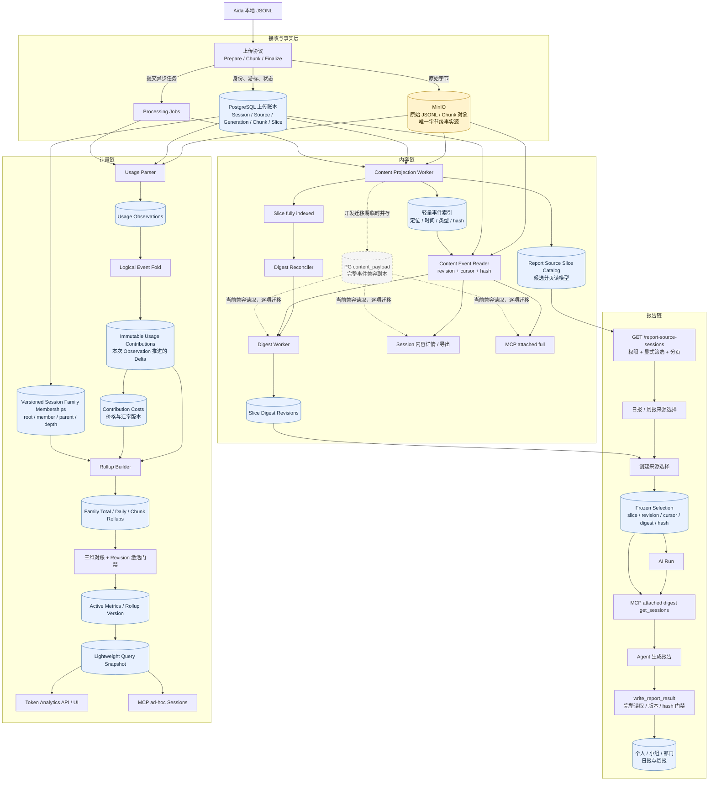

这张图有四个必须保持的边界：

1. 上传响应只等待对象与上传账本被可靠接受，不等待 Projection、Digest、Usage 或 Rollup。
2. Report Source 列表只读 Catalog；它不读 MinIO、不扫事件明细、不计算 Token。
3. attached Digest MCP 只读已经冻结的 PostgreSQL Payload；不会在 Agent 等待期间实时读取 MinIO。
4. Token 查询只读已激活 Rollup/Snapshot；不会在请求内重新解析 JSONL 或重新计价。

## 2. 数据身份如何贯穿全链路

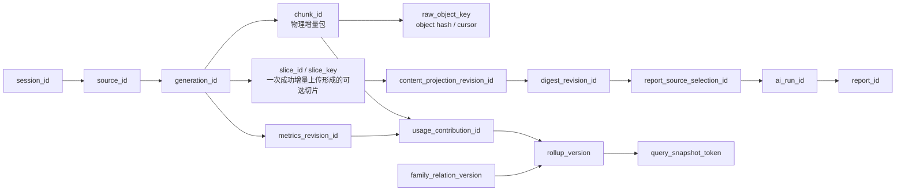

| 身份 | 作用 | 不能替代 |
| --- | --- | --- |
| `session_id` | 用户看到的逻辑会话 | 不能表示具体上传版本 |
| `generation_id` | 一套可校验、可激活的上传代次 | 不能表示单个新增 Chunk |
| `chunk_id` | 一次被接受的物理增量包 | 不等同于报告业务 slice |
| `slice + cursor` | Report Source 可选择和冻结的内容边界 | 不等同于自然日 |
| content revision | 本次内容投影版本 | 不代表 Usage 已就绪 |
| metrics revision | 本次 Usage/Token 计算版本 | 不代表 Digest 已就绪 |
| family relation version | 本次 root/Subagent 归属版本 | 不应固化进不可变 Contribution |
| snapshot token | 固定一次 Token 查询看到的版本集合 | 不是原始事实副本 |

任何链路如果只用 `session_ref + 日期` 猜测数据来源，就会丢失上传、冻结、重算和 Subagent 关系变化的版本边界。

## 3. 上传后的并行处理时序

下图描述逻辑时序；原始对象具体通过 API 中转还是预签名上传，不改变“对象确认 + 账本接受后才返回成功”的一致性边界。

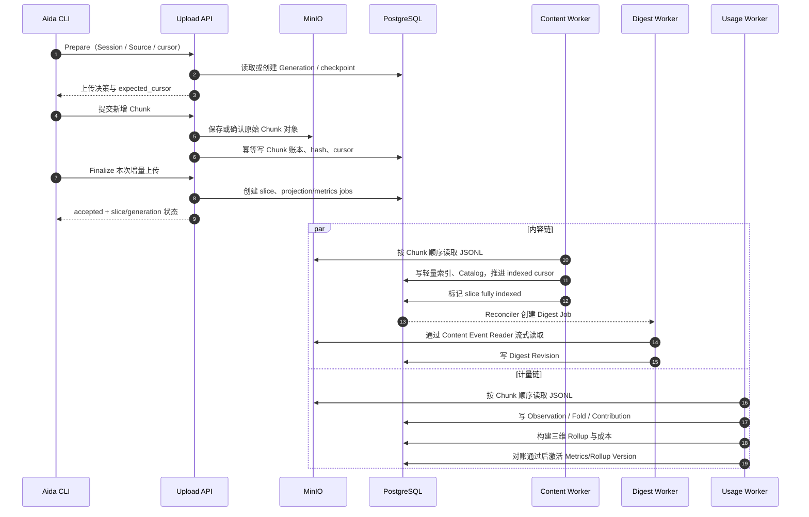

关键点：

- 内容 Worker 和 Usage Worker 可以先后完成，失败和重试也互不冒充；
- 相同 Chunk 的重试靠身份、cursor、hash 和幂等键避免重复写入；
- 前端应显示各自的 pending/ready 状态，不能因为“上传成功”就显示 Token 和 Digest 均已完成；
- 后台回填、离线对账和重算必须限流，不能占满前台请求连接池。

## 4. Report Source、Digest 与报告生成

### 4.1 候选列表

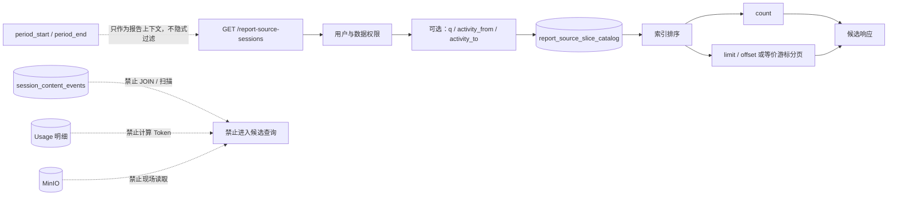

候选分页成本只允许与命中的 Catalog 行数和索引有关，不得再与某个 Session 包含 18 万还是 300 万事件有关。

### 4.2 选择、冻结与 Agent 读取

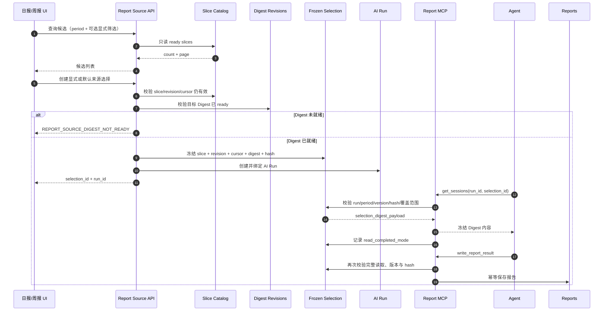

这里有两条不同的 MCP 内容路径：

- `attached digest_v1/v2`：始终读取冻结 Payload，不依赖实时 MinIO；
- `attached full`：外部分页契约不变，内部从 PostgreSQL `content_payload` 迁到 MinIO Reader。

Session 内容详情与导出和 `attached full` 共用 MinIO Reader 能力，但权限、事件顺序、脱敏、分页 cursor 和取消语义必须保持兼容。

## 5. Token 三维统计数据流

### 5.1 从原始 Observation 到唯一增量事实

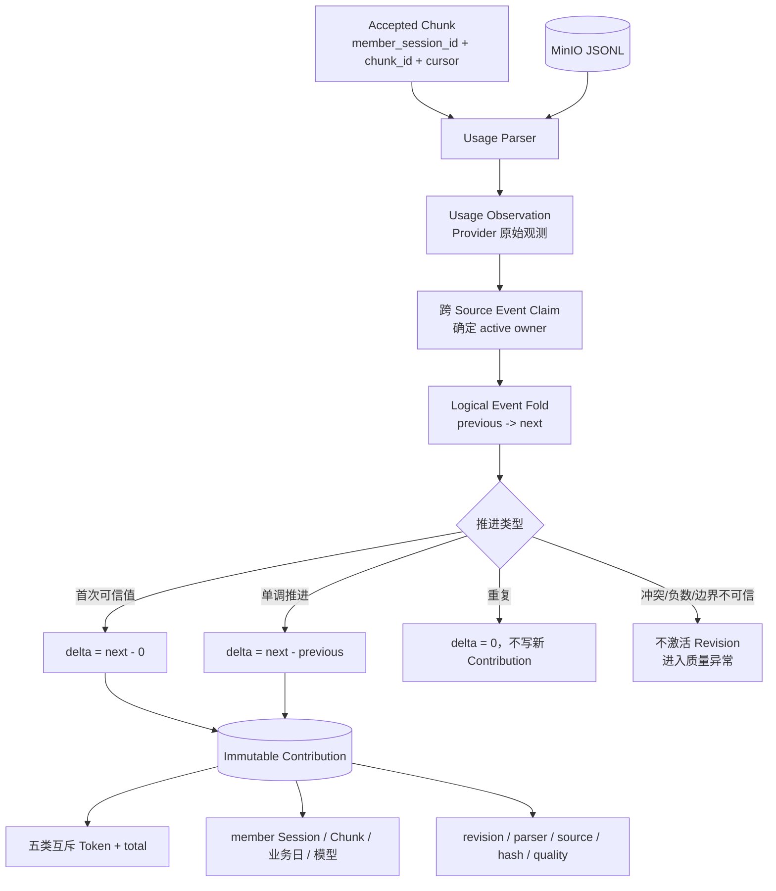

Contribution 只记录实际产生 Token 的 `member_session_id`，不固化 `root_session_id`。父子关系可能迟到或修正，root 必须在构建 Rollup 时使用指定 `family_relation_version` 解析。

### 5.2 一份 Contribution 派生三个统计维度

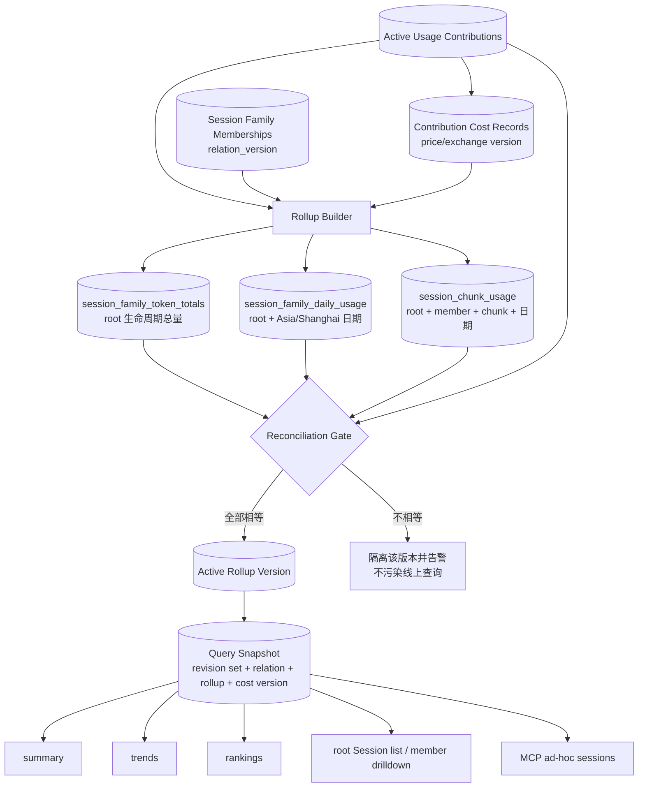

同一版本下必须满足：

```text
family_total_tokens
  = self_tokens + subagent_tokens
  = Σ daily.total_tokens
  = Σ chunk.total_tokens
  = Σ active_contribution.total_tokens

family_total_cost
  = self_cost + subagent_cost
  = Σ daily.cost
  = Σ chunk.cost
  = Σ active_contribution_cost.cost
```

其中 Chunk 指 `session_upload_chunks` 的物理增量包，不是 Report Source slice。Claude 同一消息跨两个 Chunk 从 `100 -> 160` 时，Contribution 必须是 `Chunk A = 100`、`Chunk B = 60`，而不是 `0 + 160`。

普通查询只选择已经激活的版本。新增 Chunk、Subagent 父关系补齐、Parser 修复或显式重计价均生成新版本并使受影响的 Snapshot 失效，不在查询线程里重算历史。

## 6. PostgreSQL 与 MinIO 的存储职责

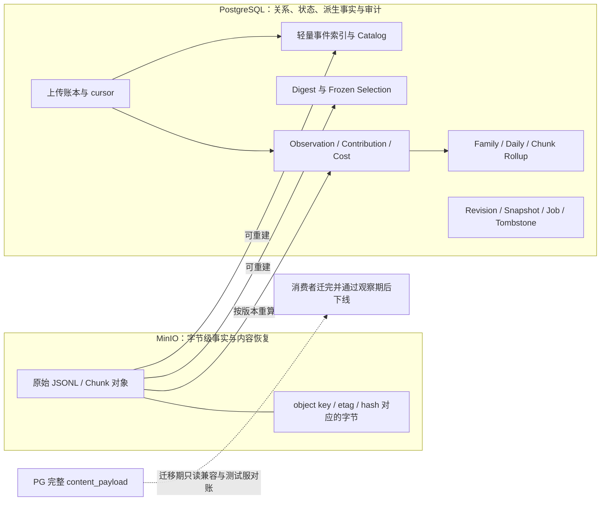

目标状态下，PostgreSQL 可以保留 MinIO object key、hash、cursor、状态以及可重建的关系/索引，但不再保存第二份完整事件 JSON。`content_payload` 下线前必须先完成全部消费者迁移、历史对象完整性验证、测试服全量对账和旧镜像回滚演练，不能直接清空 7GB 表。

## 7. 状态不是一个 Done：五条独立状态线

下图状态名以产品语义为主；具体数据库枚举应在实现时沿用现有状态或做兼容映射，不能为统一命名而破坏现有接口。

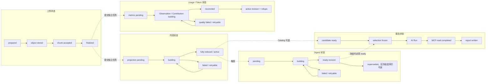

| 用户或系统看到的状态 | 能证明 | 不能证明 |
| --- | --- | --- |
| Chunk accepted | 对象和上传账本已接受 | 内容、Digest、Usage 已完成 |
| Content fully indexed | 内容边界可以稳定读取 | Token/成本已激活 |
| Catalog ready | 切片可进入候选分页 | 已被某份报告选择 |
| Digest ready | 指定 slice/revision 有可冻结摘要 | Agent 已完整读取 |
| Metrics active | 指定 Usage revision 已对账并激活 | 内容仍然保留 |
| Selection frozen | 报告来源版本已经固定 | Session 已结束 |
| MCP read completed | Agent 已按绑定模式完整读取 | 报告结果一定已成功保存 |

## 8. 内容清理与恢复的数据流

### 8.1 清理内容

当前代码已经把“内容清理”和“计量删除”分开。系统先为各 Generation 构建并校验 Metering Envelope，校验全部通过后才允许删除 MinIO Chunk；只有对象全部删除且 Manifest 再次确认完整，清理才最终完成。

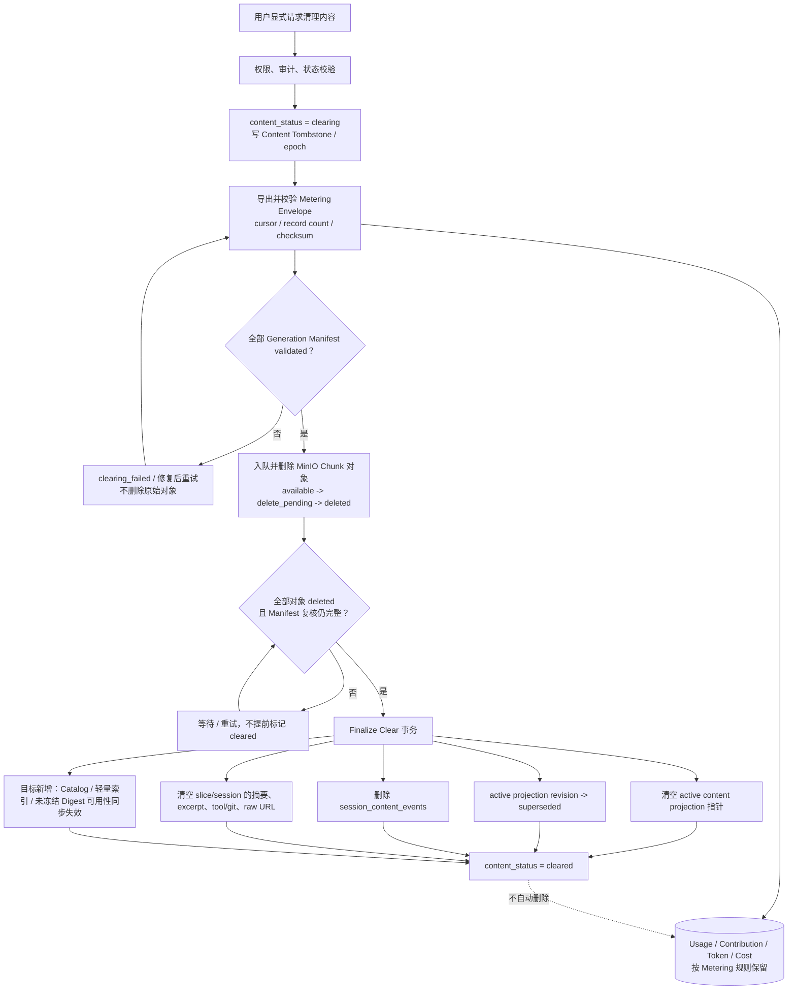

必须明确：

- 清理的是用户内容，不是自动抹掉已经确认的 Token 与成本；
- Metering Envelope 是允许删除原始内容前的计量完整性门禁，不是第二份完整 JSONL；
- 现有实现已经删除内容事件、清空内容摘要和原始 URL；Catalog、轻量索引与 Digest 的目标表上线后，必须补充同一 epoch 下的失效规则；
- 现有 `session_activity_slices` 只清空摘要、excerpt、tool/git 和 raw-log 标记，Token 字段不作为内容字段一并删除；
- 已冻结报告及其审计保留策略必须单独遵守业务与合规要求，不能通过残留派生数据绕过 `CONTENT_CLEARED`；
- 清理未完成时不得向用户谎报 `cleared`。

### 8.2 恢复内容

恢复不是从 PostgreSQL 找回已删除 JSON，也不是把旧 MinIO key 重新标记 available；它需要 Aida 在恢复窗口内重新上传原始内容，生成新的 epoch/generation 并重建内容投影。

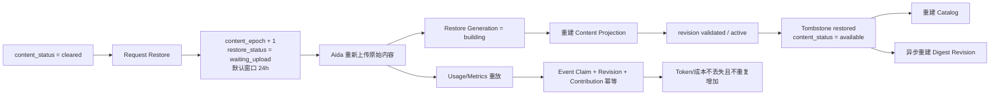

恢复链路必须回归 `TOK-3D-014`：Metering Envelope 与恢复上传重放后，Token/成本既不能丢，也不能因为同一历史内容重新上传而翻倍。

## 9. 用户请求允许读取什么

| 请求/消费者 | 目标在线数据源 | 明确禁止 |
| --- | --- | --- |
| Report Source 候选 | `report_source_slice_catalog` | 事件明细、MinIO、Usage、现场 Digest |
| 创建来源选择 | Catalog + ready Digest revision | 未就绪时同步扫描 JSONL |
| MCP attached digest | Frozen `selection_digest_payload` | 实时 MinIO、非冻结最新 Digest |
| MCP attached full | Content Event Reader + 冻结 revision/cursor | 无边界全对象扫描、静默空结果 |
| Session 内容详情/导出 | Content Event Reader | 继续永久依赖 `content_payload` |
| Token summary/trends/rankings/sessions | 同一 Snapshot 下的三维 Rollup | 请求时解析 JSONL、扫描 Component、重新计价 |
| MCP ad-hoc sessions | 兼容期原路径；目标为经过对账的 Rollup/Snapshot | 因 Report Source 去 Token 而误删 MCP Token 字段 |
| `write_report_result` | Frozen Selection + read-completion audit | 弱化版本、hash、完整读取门禁 |

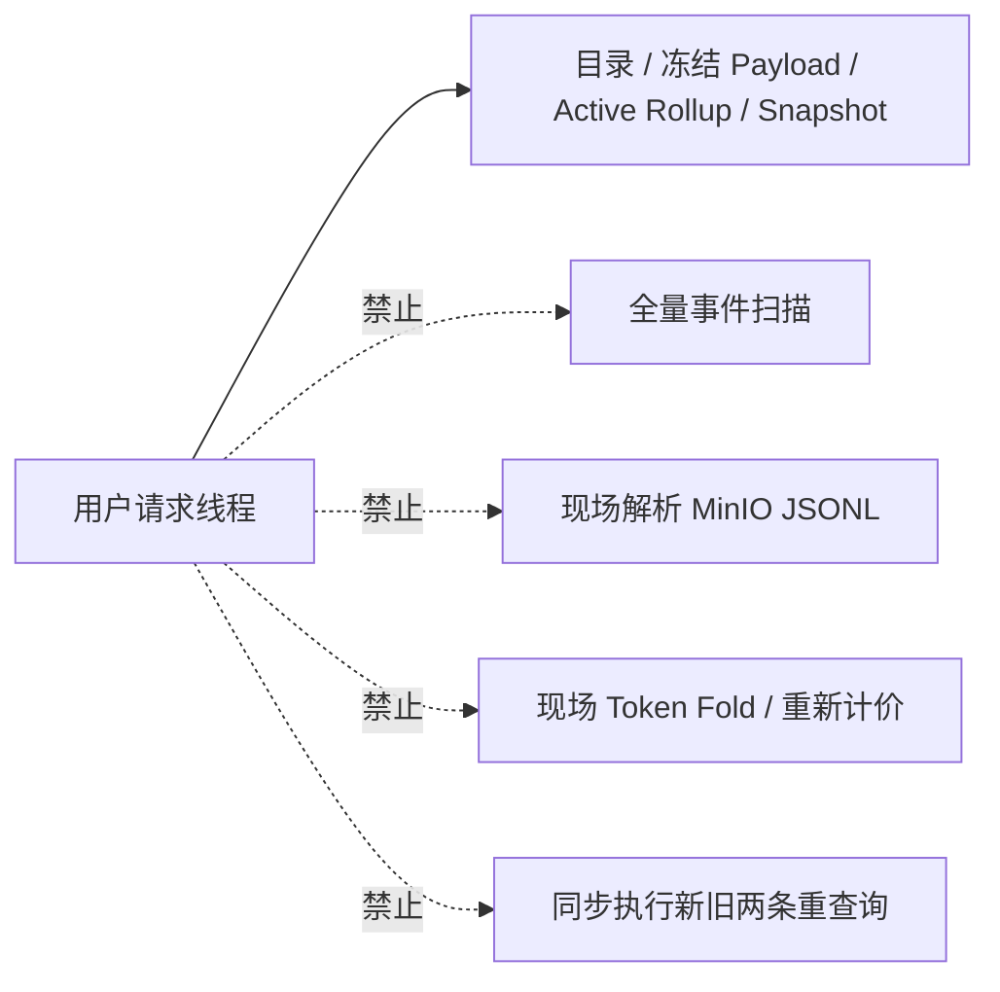

数据对账只在测试服或后台离线任务中执行，不形成生产用户请求的双读链路。数据库 CPU、I/O、连接池等待或既有接口 p95 超阈值时，回填与离线对账任务必须自动暂停。

## 10. 当前到目标的替换关系

| 当前链路 | 目标链路 | 切换前门禁 |
| --- | --- | --- |
| Report Source 扫 `session_content_events` | 只读 slice catalog | 测试服全量回填、结果对账、分页性能、旧镜像回滚演练 |
| Projection 双写完整 `content_payload` | 只写轻量 index + Catalog | 全部内容消费者已迁 MinIO Reader |
| Digest 读 PG JSONB | Digest 读 MinIO Reader | 事件覆盖、顺序、source hash、digest hash 一致 |
| MCP attached full 读 PG JSONB | 按冻结 cursor 流式读 MinIO | 多页无重无漏、cursor 可重试、权限一致 |
| Component 当前值承担查询聚合 | Contribution Delta + 三维 Rollup | active revision 在测试服全量对账通过 |
| 高基数 Snapshot Items | 轻量版本化 Snapshot | 四类 Token 接口同 Snapshot 一致 |
| Session 行按实际 `session_id` | 默认按 root family 去重 | Subagent 关系、旧字段兼容、总量防重复 |
| Component 绑定成本 | Contribution 绑定版本化成本 | Token 不变、成本三维精确对账 |

这些替换必须拆成独立发布单元：Report Source、内容读取/存储、Token Contribution、Token API/MCP 不在一次大发布中全部切换；但每个单元只有一条目标实现路径，测试服全量验收后整体切换，不建运行时模式开关。

## 11. 故障时如何退化

| 故障 | 正确表现 | 禁止表现 |
| --- | --- | --- |
| MinIO 暂时不可读 | 新 Projection/Digest/full 读取延迟或明确失败 | 生成空 Digest 并标成功 |
| Catalog Worker 失败 | 该 slice 保持 building/failed 并重试 | 候选接口回退扫描事件表 |
| Digest 未就绪 | 返回 `REPORT_SOURCE_DIGEST_NOT_READY` | 用户请求线程现场生成 |
| Usage Parser 冲突 | 新 Metrics Revision 不激活并告警 | 猜测 Delta 后计费 |
| 三维 Rollup 不相等 | 隔离新版本，线上继续读上一 active 版本 | 只修一张汇总表后切换 |
| parent 元数据迟到 | 生成新 relation version、重建家族 Rollup | 原地改不可变 Contribution |
| 回填/离线对账影响前台 p95 | 自动暂停专项后台任务 | 为追赶进度继续抢占资源 |
| 内容清理条件不完整 | 保持 clearing 并重试 | 提前标 cleared 或丢失计量依据 |

## 12. 实现与回归索引

- Digest、MCP、内容详情、清理恢复逐项影响见 [06-Digest 与接口影响回归矩阵](./06-Digest与接口影响回归矩阵.md)；
- Contribution、Subagent、三维 Rollup、成本与对账规则见 [07-Token 三维统计与对账模型](./07-Token三维统计与对账模型.md)；
- 发布分批、迁移门禁、回滚和测试顺序见 [05-开发迁移与测试验收](./05-开发迁移与测试验收.md)；
- 任何实现若与本文总图冲突，应先回到 [现状产品形态与核心边界](./01-现状产品形态与核心边界.md) 确认产品语义，而不是直接修改线上结果。

## 13. 最终验收的五条端到端断言

1. 一个新增 Chunk 上传成功后，内容和 Token 可以异步先后就绪，但最终都能追溯到同一 Chunk、cursor 和 revision。
2. 一个包含任意层级 Subagent 的 root Session，在相同版本下满足 `family = self + subagent = daily = chunk = contribution`。
3. 一份已冻结报告在 Session 后续上传、Digest 升级或 Token 重算后仍读取原来的 slice/revision/hash，不发生漂移。
4. Report Source 分页不随原始事件体量增长，Token 查询不在请求时解析 JSONL，attached Digest 不依赖实时 MinIO。
5. 清理内容后原始字节与内容派生数据不可继续作为可用内容读取，Token/成本按已校验 Metering 事实保留；恢复重放后内容可重建且计量不翻倍。
