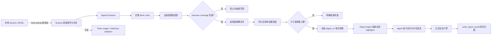

# 02 架构与开发方案

## 1. 数据流程



## 2. 职责边界

| 层 | 负责 | 不负责 |
| --- | --- | --- |
| Extractor | 遍历事件、识别 Work Unit、结果证据、状态、时间 | 判断哪项最重要 |
| 日级投影 | 保留全部结果型 Work Unit，缩短文本 | Top-K、主题聚类、版本替换 |
| 选择级合并 | 跨切片汇总、来源精确去重、完整性计数 | 模糊语义去重、最终态覆盖旧阶段 |
| Budget | 均匀缩短文本、去除证据明细、执行硬上限 | 按优先级删除成果 |
| Report Agent | 阅读全部成果、语义合并、写用户可读日报 | 重读原始 Session、猜测遗漏内容 |
| 正文门禁 | 阻止内部 ID、路径、命令等泄漏 | 限制日报最多几项 |

## 3. 数据契约

`DailySummary` 新增：

```json
{
  "date": "2026-07-16",
  "highlights": [],
  "highlights_truncated": false,
  "outcome_coverage": {
    "source_count": 18,
    "represented_count": 18,
    "complete": true,
    "text_compacted": true
  }
}
```

字段含义：

- `source_count`：当天进入低损耗投影的不同结果型 Work Unit 数；
- `represented_count`：实际保留的 highlight 数；
- `complete`：两者相等且没有条目截断；
- `text_compacted`：条目文本或证据字段曾因预算缩短，不表示条目被删除；
- `highlights_truncated`：v2.8 完整快照必须为 false，保留字段用于兼容和腐败检测。

## 4. 提取与去重规则

### 4.1 纳入条件

满足任意条件即纳入：

- `result_statements` 非空；
- `unresolved` 非空；
- 状态为 `failed`；
- 状态为 `blocked`。

### 4.2 允许的清洗

- 去掉空文本；
- 同一 Work Unit 内规范化后完全相同的结果语句去重；
- 限制单个 goal、result、unresolved 文本字节数；
- 限制证据引用数量，必要时清空证据明细；
- Session 注入说明、原始工具大输出、图片和 Token 遥测仍不进入报告投影。

### 4.3 禁止的清洗

- 按分数只保留前 N 项；
- 因为出现相同产品名或版本号而删除 Work Unit；
- 把整个 Work Unit 改写为某个检测到的资产发布；
- 以证据等级低为由删除失败、阻塞或待跟进；
- 跨来源按相似文本做模糊去重。

## 5. 字节预算策略

压缩顺序固定：

1. 完整结构；
2. 均匀缩短所有 Work Unit 和 daily highlight 文本；
3. 进一步均匀缩短，并减少证据引用；
4. 删除详细 Evidence、Changes、Validations，保留结果投影；
5. 若 daily summary 已证明完整，可从 item 中删除重复的详细 Work Units；
6. 对全部 highlights 做最小文本压缩，但保持条目数量；
7. 选择冻结仍超过硬上限时返回 `ErrDigestLimitExceeded`。

目标预算仍为 64 KiB，选择级硬上限仍为 128 KiB。本轮不通过提高默认上限掩盖问题。

## 6. 代码改动

| 模块 | 改动 |
| --- | --- |
| `internal/sessiondigestv2/model.go` | 版本升至 v2.8.0；增加 `OutcomeCoverage` |
| `internal/sessiondigestv2/daily.go` | 移除日级条目上限和语义筛选；按时间保留全部结果 Work Unit |
| `internal/sessiondigestv2/consolidate.go` | 移除选择级 Top-K 和模糊 supersede；仅按来源引用精确去重 |
| `internal/sessiondigestv2/budget.go` | 从优先级删项改为均匀文本/证据压缩；成果条目不可删除 |
| `internal/reportsource/digest_v2.go` | 冻结、读取和写回校验完整 `outcome_coverage` |
| `service/daily_report_skill.go` | Agent 读取全部 highlights，无固定条目上限，引用级覆盖检查 |
| `handler/managed_agent.go` | 默认 Agent 指令和运行消息同步低损耗契约 |
| `handler/report_content_validation.go` | 删除个人日报最多 6 项的写回限制 |

## 7. 兼容与影响

### 7.1 不受影响

- Aida upload 的 prepare/chunk/finalize；
- Session 原文和切片数据；
- token usage、metering、Token analytics；
- 候选 Session 列表、分页与日期筛选；
- MCP 工具名称和调用入口；
- 数据库表结构和迁移版本。

### 7.2 有变化

- v2 Digest 版本变化会触发摘要重建；
- Agent 可见的 `DailySummary` 增加 `outcome_coverage`；
- 冻结载荷和 Agent 输入 Token 会高于 v2.7.9，但仍远小于 Session 原文；
- 日报正文可能超过 6 项；
- 极端成果数量超过 128 KiB 时会明确失败，而不是输出不完整日报。
