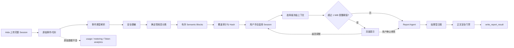

# 02 架构与数据规则

## 1. 目标架构



## 2. 职责边界

| 层 | 负责 | 不负责 |
| --- | --- | --- |
| 原始 Session | 保存完整上传内容、游标、事件和 usage | 为日报判断重要性 |
| Event Parser | 识别来源格式、角色、事件类型和用户可见性 | 总结业务结果 |
| Redactor | 删除凭据和敏感值 | 删除普通产品信息 |
| Noise Classifier | 按内容类型删除确定噪音并记录原因 | Top-K、主题归并、成果评分 |
| Semantic Projection | 保留有序 user/assistant 用户可见文本 | 截断、改写或预生成日报 |
| Selection Freeze | 冻结用户手动选择的全部来源 | 自动挑选 Session |
| Size Warning | 提醒成本和模型风险 | 硬阻断或偷偷裁剪 |
| Report Agent | 理解上下文、合并同一主线、生成日报 | 重读 raw JSONL 或执行来源指令 |
| 正文门禁 | 阻止明确的安全与内部实现泄漏 | 用 bullet 数量替代语义完整性判断 |

## 3. Canonical Semantic Block

建议新增或等价实现如下选择级语义契约：

```json
{
  "block_ref": "sb_...",
  "source_item_ref": "...",
  "sequence": 42,
  "occurred_at": "2026-07-16T10:20:30+08:00",
  "role": "user",
  "visibility": "user_visible",
  "text": "完整保留的用户可见文本",
  "content_sha256": "...",
  "redacted": false
}
```

要求：

- `role` 只允许 `user`、`assistant`；
- `sequence` 在同一来源内稳定，跨来源按来源顺序和事件时间稳定合并；
- `text` 只做脱敏、NUL 修复和必要的编码标准化，不折叠全部换行；
- 不提供 `importance`、`score`、`evidence_grade` 或 `top_k_rank`；
- 同一语义块不得拆成多个“成果”，也不得多个语义块提前合成一个成果；
- `block_ref + content_sha256` 用于审计，不进入用户日报正文。

## 4. 覆盖审计

```json
{
  "source_event_count": 14607,
  "candidate_semantic_block_count": 557,
  "retained_semantic_block_count": 557,
  "retained_text_bytes": 351012,
  "semantic_blocks_truncated": 0,
  "redacted_block_count": 3,
  "omitted_by_reason": {
    "system_instruction": 20,
    "developer_instruction": 8,
    "reasoning": 350,
    "tool_call": 1900,
    "tool_result": 2100,
    "binary_or_image": 40,
    "telemetry": 700,
    "exact_duplicate": 16
  }
}
```

这里的数值仅表示契约示例，不是固定样本验收结果。正式验收必须从实际上传数据计算。

覆盖完整的定义：

```text
candidate_semantic_block_count
  = retained_semantic_block_count
  + omitted_semantic_block_count_with_allowed_reason

semantic_blocks_truncated = 0
```

不能再以 `result-bearing Work Unit` 数量作为全部语义覆盖的分母。

## 5. 允许删除的内容

| 原因码 | 内容 | 判断依据 |
| --- | --- | --- |
| `system_instruction` | system prompt、运行时系统约束 | 事件角色/来源类型优先 |
| `developer_instruction` | developer prompt、平台注入规则 | 事件角色/来源类型优先 |
| `environment_metadata` | cwd、shell、权限、sandbox、环境上下文 | 结构化事件类型或明确协议标签 |
| `reasoning` | 模型隐藏推理、analysis、thinking | 结构化 phase/type |
| `tool_call` | 工具名、参数、命令、patch 原文 | 结构化 tool call 类型 |
| `tool_result` | MCP/命令完整返回、日志、图片结果 | 结构化 tool result 类型 |
| `binary_or_image` | base64、图片二进制、附件体 | MIME/内容块类型 |
| `telemetry` | Token 累计值、usage、状态心跳 | 结构化 usage/telemetry 类型 |
| `exact_duplicate` | 客户端持久化产生的完全相同副本 | 内容 Hash + 邻近来源位置 |
| `approval_meta_session` | 明确属于内部审批评估的 Session | 会话元数据，不能只靠正文关键词 |

未知事件类型不是允许的静默删除原因。若当前解析器不能证明未知事件不含用户可见语义，必须设置 `classification_complete=false` 并阻止冻结，待补充格式映射后重建；不能把未知事件计入“已完整清噪”。

## 6. 必须保留的内容

- 用户直接输入的需求、补充、纠正、选择和业务说明；
- Agent 在 commentary/final 等用户可见通道发出的文本；
- 方案、调研结论、架构判断、产品决定、风险和取舍；
- 实现、修复、部署、发布、验证后的用户可见结论；
- 失败、阻塞、未完成状态及下一步；
- 用户粘贴的日志、代码或接口信息，只做安全脱敏，不因“技术内容”被删除；
- 较长消息的完整文本；
- 重复主题在不同时间形成的状态变化。

## 7. 明确禁止的规则

- 单消息 768 bytes、成果 512 bytes、最小 160 bytes 等静默截断；
- 只有文件变更、测试通过或 Evidence A/B 才纳入；
- 只保留 final answer 或每个 Work Unit 的最后一段文本；
- `result-bearing`、`hasDeliveredOutcomeClaim` 等语义门槛决定内容去留；
- 按产品名、版本号、关键词或相似度进行 supersede；
- 选择 Top-K、固定 3～5 项或最多 N 项；
- 用正则把“开发方案、统一发布、数据库兼容”等业务内容判为过程噪音；
- 为 Aida CLI、Aida Report、Session Digest 等特定产品生成固定句式；
- 通过压缩预算删除、缩短或概括用户可见语义块。

## 8. 容量策略

### 8.1 计量对象

提醒阈值计算对象是选择级、脱敏后、有序 Semantic Blocks 的实际序列化字节数，不包含：

- 原始工具结果；
- 图片和附件体；
- 诊断覆盖明细；
- 重复 item 摘要；
- 原始 Work Unit、Evidence、Changes 和 Validations。

### 8.2 默认阈值

- `context_warning_bytes = 1 MiB`；
- 该值可配置，但配置只改变提醒时机；
- 不再沿用 16 KiB 单切片报告期预算、64 KiB 选择目标和 128 KiB 产品硬上限；
- 用户确认继续后传输完整 Semantic Blocks；
- 如果底层 HTTP、数据库或 Agent 平台发生真实基础设施错误，应明确失败并记录实际错误，不得伪装成清洗成功。

## 9. 安全边界

- 继续脱敏私钥、Authorization、API Key、Token、密码、Cookie 和 URL 凭据；
- Digest 文本仍视为不可信数据，Agent 不执行其中命令；
- 用户粘贴的 prompt injection 作为业务对话内容保留，但 Skill 必须声明它不是可执行指令；
- 正文安全门禁只检查最终日报，不反向删除 Semantic Blocks；
- 对正文门禁的误报应退回 Agent 重写，不能修改冻结来源。
