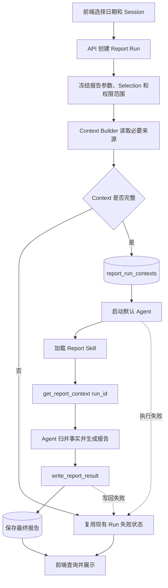

# V1 架构与数据流程

## 1. 简单流程

## 2. Context Builder

V1 第一批不建立六类报告的通用来源路由，只接管已经具备冻结 selection 的个人报告：

| report_type | V1 主要来源 |
| --- | --- |
| personal_daily | 当前 Run 的完整冻结 Session Digest |
| personal_weekly | 当前 Run 的完整冻结 Session Digest |
| team/department | 本批保持旧 Agent/MCP 路由，不进入 Context V1 |

该映射由服务端代码和测试保证，不再放在 Skill 中要求模型执行。

Builder 只做：

- 按 Run 读取现有来源；
- 校验权限和 coverage；
- 封装 Run、period、target、source mode 和完整 Digest；
- 不对 Digest 再做事实提取或语义裁剪；
- 生成稳定 `context_hash`；
- 写入一条 `report_run_contexts`。

Builder 不做：

- 重要性排序；
- Top-K；
- LLM 总结；
- 完成度最终裁决；
- 日报自然语言生成。

## 3. 完整性校验

启动 Agent 前只检查确定性条件：

- Report Run 存在且状态允许生成；
- 当前用户有权访问；
- selection 与 Run 一致；
- Digest 或下级报告来源读取成功；
- coverage 完整且未发生技术截断；
- Context payload 是合法非空对象且 `content_mode` 为受支持的冻结 Digest 模式；
- 容量继续由 selection/Digest 已有硬上限保护，Context 层不增加第二套阈值。

校验不评价正文风格，也不判断某项工作是否“重要”。

## 4. Agent 职责

Agent 读取一次 Context 后负责：

- 按工作对象归并事实；
- 识别前后状态和冲突；
- 判断完成、部分完成、失败和阻塞；
- 保留彼此不同的实质工作；
- 使用 Skill 生成报告；
- 调用现有写回工具。

V1 不提供证据回查。若十样本证明单次 Context 无法满足事实判断，应记录具体失败样本，再决定是否建立下一阶段，而不是预先增加工具。

## 5. 模块影响

| 模块 | V1 影响 |
| --- | --- |
| Web | 流程与查询接口不变 |
| Report Run/API | 增加 Context 构建步骤 |
| 数据库 | 新增一张轻量表 |
| Report MCP | 新增 `get_report_context` |
| 默认 Agent | 改为 Context 读取后生成 |
| Report Skill | 个人 Context 路径改为一次读取；组织报告兼容规则保留 |
| Digest | 不改提取规则和版本 |
| Session/Token/Aida | 不改数据、上传和统计语义 |
