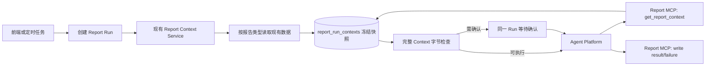

# 第六阶段架构设计：通用 Report Context V1

> 文档状态：主体架构已收敛；容量确认、Run 级安全和保护上限待验证  
> 日期：2026-07-20  
> 唯一需求基线：[01-需求文档](01-需求文档.md)

## 1. 设计边界

本文只说明如何满足已定稿需求，不新增来源规则或第六阶段能力。

- 默认在现有系统上形成最小闭环；
- 逻辑职责不等于新包、新接口、新进程或新服务；
- 未验证的建议只保留为决策项，不进入实现任务；
- 不引入 Evidence Ref、证据下钻、降级汇总、多轮取数、精确 Token 估算或通用证据系统。

## 2. 一页决策差异

| 类别 | 本阶段变化 |
|---|---|
| 产品行为 | 六类报告的基础事实统一由平台准备；同一 Run 复用冻结 Context；默认 Agent 只读取一次 Context |
| 主要代码变化 | 扩展现有 `reportcontext.Service`；六类 Report Run 统一接入；Report MCP 和默认 Skill 收敛到 Context 读取 |
| 数据资源 | 计划复用 `ai_runs`、`report_run_contexts` 和现有报告表；当前没有新增表或迁移的已确认需求 |
| 接口变化 | 容量确认需要能定位同一 Run，具体协议待验证后确认 |
| 安全变化 | MCP 读取与写回需验证并补足“有效执行用户 + 当前 Run”绑定；不预设新令牌体系 |
| 容量变化 | 对完整序列化 Context 做字节检查；软提醒沿用产品语义，保护上限不在验证前设定 |
| 明确不做 | Digest 改造、组织成员 Session、自动降级、分页给 Agent、多轮取数、未来自定义 Skill 产品化 |

## 3. 已验证代码事实

| 编号 | 已验证事实 | 代码证据 | 对设计的影响 |
|---|---|---|---|
| F-01 | 已有 `report_run_contexts` 按 `run_id` 保存 JSONB Payload、Hash 和字节数 | `api/db/migrations/022_report_context_v1.sql` | V1 可先复用现有快照载体 |
| F-02 | 当前 `reportcontext.Service` 只构建 Selection 支撑的个人报告 Context，读取时按 `run_id + ai_runs.user_id + business_type` 校验 | `api/internal/reportcontext/service.go` | 需要扩展现有深模块，而不是另建并行 Context 系统 |
| F-03 | 当前个人报告先冻结 Selection；超过 1 MiB 时还没有 Run；确认后才创建 `ai_runs`，随后构建 Context | `api/internal/reportsource/service.go:357-449`、`api/handler/managed_agent.go:2570-2617` | 当前容量确认不能满足“同一 Run、同一完整 Context”目标，必须调整时序或确认协议 |
| F-04 | 非个人报告当前只创建 pending Run，不构建 Report Context | `api/handler/managed_agent.go:2615-2617`、`api/handler/managed_agent.go:4124-4126` | 六类报告需要统一接入 Builder |
| F-05 | Report MCP 当前从普通用户 JWT 得到用户身份；Agent 平台 credential metadata 中的 `ai_run_id` 不会被 Aida 鉴权代码读取 | `api/handler/middleware.go`、`api/handler/report_mcp.go:200-230`、`api/handler/managed_agent.go:2623-2631` | 当前能校验用户所有权，但不能证明调用凭据只绑定当前 Run |
| F-06 | 用户记录只有一个可选 `team_id` 和一个可选 `department_id`；Team 可属于 Department | `api/model/models.go`、`api/handler/department.go` | V1 不需要设计多小组归属算法；部门直属成员可按“部门内且未被直属小组覆盖”识别 |
| F-07 | 需求可显式关联多个小组；任务属于需求并有独立负责人；需求和任务具有 `created_at`、`updated_at`、`completed_at`，没有本阶段可复用的完整事件历史 | `api/model/models.go`、`api/db/migrations/001_init.sql` | 周期范围按需求定义采用 `updated_at` 现实口径；任务按直接负责人收敛，不能用父需求扩散全部任务 |
| F-08 | 六类报告已有对象与周期唯一约束，部门维度的唯一索引由后续迁移补齐，写入逻辑使用对应冲突键 | `api/db/migrations/001_init.sql`、`api/db/migrations/015_department_report_scope.sql` 及报告写入代码 | 下级报告按精确对象和周期查询；若历史异常仍产生重复，构建失败而非任意取一条 |
| F-09 | 定时报告 Run 使用 Schedule 对应用户创建，并按 Schedule 时区计算周期 | `api/handler/managed_agent.go:4068-4145` | 定时 Run 的有效执行用户为 Schedule 用户，时区必须冻结进运行事实 |
| F-10 | 当前 1 MiB 是 Selection Digest 的产品提醒阈值；64 MiB 是 Digest 聚合包络，不是完整 Report Context 或模型硬上限 | `api/internal/reportsource/digest.go:26-40,72-84` | 完整 Context 只能按字节做软提醒和平台保护，不能宣称精确模型可容纳 |

## 4. 最小目标架构

V1 保留一个对调用方入口很小、内部职责完整的 Report Context 模块：调用方只负责提供已经建立的 Report Run 身份并请求构建或读取；来源选择、服务端内部分页、去重、精确报告选择、覆盖计算、规范化、冻结和 Hash 都留在模块内部。



图中的“读取现有数据”是模块内部职责，不要求创建 Session Reader、Report Reader、Organization Reader 等公开接口。只有测试或现有代码重复确实证明需要时，才做包内局部抽取。

## 5. Context 最小产品契约

Context 只包含《需求文档》定义的本次报告基础事实：

```text
Report Context
├── run：run_id、报告类型、对象、周期、时区、触发方式、请求模型
├── scope：有效执行用户、权限范围、组织范围
├── coverage：组织成员或直属小组及来源可用状态
├── source_reports：下级报告冻结正文及其现有标识、周期和更新时间
├── requirements：当前范围和周期内的需求事实
├── tasks：当前范围和周期内的任务事实
├── sessions：本次实际采用的 Session Digest
└── source_issues：missing、invalid 或组织异常
```

约束：

- 个人报告没有组织覆盖时，对应集合为空，不发明无意义对象；
- Context 保存实际事实快照，不只保存可变记录 ID；
- 数组按稳定业务键排序，去重后再序列化和计算 Hash；
- 同一 Run 构建成功后只读，不重新读取当前业务表；
- Agent 一次逻辑调用获得完整 Context；服务端为完成构建可以内部分页，分页细节不暴露给 Agent。

容量不属于冻结事实 Payload。`context_bytes`、容量提醒、用户确认和平台保护结果属于 Context 存储或 Run 运行元数据，避免 Context 大小计算自引用，也避免用户确认改变已冻结事实。

重复下级报告会直接导致 Context 构建失败，因此只进入 Run 失败原因和诊断日志，不写入一个并不存在的成功 Context。

## 6. 来源映射

| 报告类型 | Session | 下级报告 | 需求与任务 | 覆盖事实 |
|---|---|---|---|---|
| 个人日报 | 当日默认或明确选择；选择只替换 Session 部分 | 无 | 个人范围 | 无 |
| 个人周报 | 仅明确选择时补充 | 本人周期内个人日报 | 个人范围 | 无 |
| 小组日报 | 无 | 成员个人日报 | 小组范围 | 成员与个人日报状态 |
| 小组周报 | 无 | 成员个人周报 | 小组范围 | 成员与个人周报状态 |
| 部门日报 | 无 | 直属小组日报、未被小组覆盖的直属成员个人日报 | 部门范围 | 直属小组、直属成员及报告状态 |
| 部门周报 | 无 | 直属小组周报、未被小组覆盖的直属成员个人周报 | 部门范围 | 直属小组、直属成员及报告状态 |

需求和任务范围严格复用需求第 5 节：小组任务只因当前小组成员是直接负责人而进入；父需求命中不扩散其他成员任务。部门采用直属小组和部门直属成员的直接负责人范围。现有通用列表查询若语义更宽，Context 构建不得直接照搬。

## 7. Run 时序和失败归属

目标时序是必要产品结果，而不是对当前代码现状的描述：

1. 校验发起身份、报告对象、周期、时区、请求模型和 Selection；
2. 创建 pending Report Run，形成稳定 `run_id`；
3. 按该 Run 构建并冻结完整 Context；
4. 构建失败记录到该 Run，不启动 Agent；
5. 对冻结 Context 做字节容量检查；
6. 无需确认则启动 Agent；需要确认则保留该 Run 和 Context，确认后不重新取数；
7. Agent 读取当前 Run 的 Context并写回结果或失败；
8. 更换模型创建新 Run；Session Selection 按新请求的明确输入处理，默认来源按新 Run 创建时重新冻结。

当前接口不能完整承载第 6 步，因此容量确认协议必须先完成 A-04 验证与确认。

## 8. 架构决策记录

| 决策 | 对应需求 | 当前代码事实 | 待解决问题 | 候选方案 | 选择方案 | 验证证据 | 状态 |
|---|---|---|---|---|---|---|---|
| A-01 扩展现有 Context 深模块 | 2、3、4、8、11 | F-01、F-02、F-04 | 六类来源尚未统一 | 扩展现有模块；另建平行 Builder | 扩展 `reportcontext.Service`，保持小入口、隐藏来源细节 | 现有表与模块已承载个人报告 Context | 已确认 |
| A-02 复用现有快照表 | 3.2、8 | F-01 | 现有快照载体是否足够 | 复用现有 JSONB；调整现有表结构 | V1 复用 `report_run_contexts`；只有实现证据证明现有列不足时才重新评审 | 现有列已含 Payload、Hash、Bytes、Run 外键 | 已确认 |
| A-03 精确且完整地读取来源 | 4、5、7、8 | F-06、F-07、F-08 | 范围扩散、分页遗漏和重复报告 | 复用宽查询；专用内部查询 | 在 Context 模块内部按需求规则读取、完整翻页、稳定去重；重复下级报告使构建失败 | 需求规则与现有唯一键 | 已确认 |
| A-04 同一 Run 容量确认 | 8、9 | F-03、F-10 | 当前提醒发生在 Run 创建前 | 重提请求建新 Run；同一 Run 恢复；单独确认动作 | 必须复用同一 Run 和冻结 Context；具体交互经最小验证后确认 | 尚缺当前前端与运行入口恢复契约验证 | 待验证，仅阻塞容量确认接入 |
| A-05 Run 绑定鉴权 | 10 | F-05 | 普通用户 JWT 只能证明用户，不能证明当前 Run | 增强现有校验；使用可验证的 Run 作用域声明 | 先验证现有凭据链可提供的声明，再选择最小校验方式；不默认建设新令牌体系 | 尚缺端到端凭据传递验证 | 待验证，仅阻塞 Run 级安全切换 |
| A-06 完整 Context 容量口径 | 9 | F-10 | 无可信模型 Token 上限，完整 Context 尚无 Aida 保护值 | 伪 Token 估算；复用 Digest 上限；序列化字节软提醒与 Aida 保护值 | 使用序列化字节；只验证 Aida 可控的传输、存储和 MCP 路径，不推导通用模型上限 | 尚缺 Aida 自身大 Payload 边界测试 | 待验证，仅阻塞保护上限与发布 |
| A-07 默认 Agent 收敛 | 11 | F-02、F-04 | 组织报告仍自由调用基础读取工具 | 保留旧编排；统一一次 Context | 六类默认 Agent 只读取当前 Run Context；写回工具保持 | 需求明确且现有 MCP 已有读取入口 | 已确认 |

## 9. 安全、容量与兼容性

### 9.1 安全

- `run_id` 不是授权凭据；
- 手动 Run 使用发起用户，定时 Run 使用 Schedule 用户；
- Context 读取与结果写回必须使用同一“有效执行用户 + 当前 Run”校验；
- 越权与不存在统一返回不可区分结果；
- A-05 未确认前，不宣称当前用户 JWT 已实现 Run 级绑定。

### 9.2 容量

- 统计冻结后完整 Context 的序列化字节数；
- 1 MiB 可继续作为产品软提醒候选，但必须通过 A-04 验证确认其交互；
- 64 MiB Digest 包络不得直接当作完整 Context 或模型硬上限；
- 平台保护上限只依据 Aida 能控制并稳定复现的请求、存储和 MCP 路径确定，不尝试推导所有 Agent 平台或模型的统一上限；
- 外部拒绝保留为外部执行失败，不伪装成来源缺失。

### 9.3 兼容性

- 不修改 Session 上传、Digest、usage、metering 和 Token Analytics；
- 不修改六类报告保存口径；
- 默认 Skill 在六类 Context 全部可用后再删除其自由基础取数路径；
- 本阶段不主动删除既有原子 MCP 读取工具；默认 Agent 不再使用。其长期兼容策略不纳入本阶段。

## 10. 架构验证项

| 编号 | 对应决策 | 最小验证方法 | 通过条件 | 失败后动作 |
|---|---|---|---|---|
| V-01 | A-04 | 用当前 Web/API 请求复现大 Context，验证创建 Run、返回提醒、确认和启动的最小协议 | 确认前已有唯一 Run 和冻结 Context；确认后不重新查询来源且不创建第二 Run | 重新评审确认交互，不开始实现 |
| V-02 | A-05 | 追踪 Agent credential 从创建到 MCP 请求的实际 Header，验证 Aida 可获得哪些可校验声明 | Aida 能同时验证有效用户和当前 Run，且写回使用相同约束 | 在现有认证链上选择最小补强；确实无法满足时再单独评审新凭据形式 |
| V-03 | A-06 | 逐级增加完整 Context Payload，只测试 Aida 请求、存储和 Report MCP 可控链路 | 得到可重复的 Aida 安全区间和失败行为；外部模型拒绝仍作为外部失败 | 不设置伪模型硬限制，只保留软提醒和经验证的 Aida 保护值 |

## 11. 架构评审结论

- 已确认：复用现有 Context 快照、扩展现有深模块、六类确定性来源、默认 Agent 一次读取；
- 待验证：同一 Run 容量确认、Run 作用域鉴权、完整 Context 保护上限；
- 六类 Context 构建、来源范围、冻结和模块级测试可以进入开发；
- A-04、A-05、A-06 未确认前，只暂停各自对应的容量确认、安全切换和保护上限实现；
- 三项验证全部关闭、六类真实链路通过后，才允许发布。
